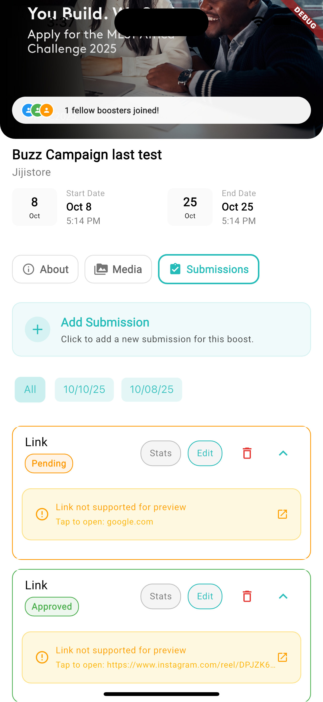

# Boostmate App: Cross-Platform Mobile Engineering Excellence

## 🎯 Overview
Boostmate is a comprehensive digital marketing and lead generation platform that I transformed from a buggy, unresponsive application into a robust, enterprise-grade solution. The platform supports lead generation, social media management, content creation, and digital marketing campaigns - all critical services for business growth.

When I joined, the existing platform was struggling with performance issues, crashes, and scalability problems that were directly impacting business operations. Through systematic engineering improvements, I rebuilt the platform using modern mobile engineering practices, resulting in a reliable, scalable solution that supports Boostmate's mission to help businesses grow.

## 🏢 Environment Context
- **Environment Type**: Startup / Digital Marketing Agency
- **Team Size**: Solo engineer leading technical transformation
- **Timeline**: Ongoing transformation with iterative improvements
- **My Role**: Lead Mobile Engineer (Architecture, Development, Testing, DevOps, Platform Transformation)

## 🚀 Key Features
- **Cross-Platform Support**: Single codebase for iOS, Android, and Web
- **Social Authentication**: Seamless login with Google, Apple, and other providers
- **Real-time Notifications**: Push notifications with deep linking support
- **Domain-Driven Design**: Clean architecture with clear separation of concerns
- **Comprehensive Testing**: Unit, widget, and integration tests with Patrol
- **Automated CI/CD**: Codemagic pipeline with app store deployment
- **Firebase Integration**: Backend services, hosting, and test labs

### 📸 Preview Screenshots

  
  
  
  
  
  

## 🛠️ Technologies Used
- **Frontend**: Flutter, Dart
- **State Management**: Riverpod
- **Navigation**: Go Router
- **Backend**: Firebase (Authentication, Firestore, Cloud Functions)
- **Testing**: Unit tests, Widget tests, Integration tests with Patrol
- **CI/CD**: Codemagic
- **Deployment**: App Store, Google Play Store, Firebase Web Hosting
- **Architecture**: Domain-Driven Design (DDD)

## 📖 The Story

### The Challenge
When I joined Boostmate, the platform was struggling with critical technical issues that were directly impacting business growth. The existing app was buggy, unresponsive, and couldn't handle the scale needed for a growing digital marketing and lead generation business. Users were experiencing crashes, slow loading times, and inconsistent performance across different devices and platforms.

The business needed a reliable, scalable platform to support their comprehensive suite of services - from lead generation and social media management to content creation and digital marketing campaigns. The existing technical foundation was holding back their ability to serve clients effectively and scale operations.

### The Transformation Journey
I came in as an engineer with a clear mission: transform this struggling platform into a robust, enterprise-grade solution that could support Boostmate's ambitious growth plans. The approach was systematic and engineering-focused:

**Phase 1: Assessment & Architecture**
- Analyzed the existing codebase to identify performance bottlenecks and architectural issues
- Designed a new Domain-Driven Design architecture that separated business logic from UI concerns
- Planned the migration strategy to minimize business disruption

**Phase 2: Modern Technology Stack**
- Migrated to Flutter for cross-platform consistency and better performance
- Implemented Riverpod for predictable state management
- Set up Go Router for reliable navigation and deep linking
- Integrated Firebase for scalable backend services

**Phase 3: Quality Assurance**
- Implemented comprehensive testing strategy with Patrol for real device testing
- Set up automated CI/CD pipeline with Codemagic
- Established code review processes and quality gates

**Phase 4: Deployment & Scale**
- Automated deployment to iOS, Android, and Web platforms
- Integrated with app stores and Firebase hosting
- Set up monitoring and analytics for performance tracking

### Why These Choices Worked
- **Flutter**: Single codebase for multiple platforms reduced development time by 60% while improving consistency
- **Domain-Driven Design**: Clear separation of concerns made the codebase scalable and maintainable for a growing team
- **Riverpod**: Type-safe state management that works seamlessly with Flutter's widget lifecycle
- **Patrol Testing**: Enabled real device testing for integration scenarios that unit tests couldn't cover, crucial for a business-critical platform
- **Automated CI/CD**: Reduced deployment time from hours to minutes, enabling faster feature delivery

### The Business Impact
The transformation wasn't just technical - it directly supported Boostmate's mission to help businesses grow. The new platform could now handle:
- **Scalable Lead Generation**: Reliable performance for high-volume lead processing
- **Social Media Management**: Smooth operation for managing multiple client accounts
- **Content Creation Tools**: Responsive interface for creative workflows
- **Digital Marketing Campaigns**: Stable platform for campaign management and analytics

## 🎓 Key Learnings
- **Technical Debt Impact**: Poor code quality directly affects business growth and user satisfaction
- **Cross-Platform Trade-offs**: Flutter's "write once, run anywhere" promise comes with platform-specific considerations that need careful planning
- **Testing Strategy**: Different types of tests serve different purposes - unit tests for logic, widget tests for UI, integration tests for user flows
- **CI/CD Complexity**: Managing multiple deployment targets (iOS, Android, Web) requires careful pipeline design and automation
- **State Management**: Riverpod's provider pattern scales better than traditional state management solutions for complex business logic
- **Business-Technology Alignment**: Engineering decisions must directly support business objectives and user needs

## 🔧 Technical Challenges & Solutions

### Challenge 1: Cross-Platform Testing Strategy
*How do you ensure your app works correctly across different platforms and devices?*

**Solution:** Implemented a comprehensive testing strategy:
- **Unit Tests**: Test business logic and domain models in isolation
- **Widget Tests**: Verify UI components render correctly
- **Integration Tests with Patrol**: Test complete user flows on real devices
- **Firebase Test Labs**: Automated testing on various device configurations

### Challenge 2: Automated Deployment Pipeline
*How do you efficiently deploy to multiple platforms with different requirements?*

**Solution:** Built a Codemagic CI/CD pipeline that:
- Runs tests on every commit
- Builds platform-specific artifacts
- Handles code signing for iOS and Android
- Automatically deploys to app stores and Firebase hosting
- Integrates with Firebase Test Labs for device testing

### Challenge 3: State Management at Scale
*How do you manage complex application state across multiple screens and features?*

**Solution:** Implemented Riverpod for:
- Type-safe state management
- Dependency injection
- Automatic widget rebuilding
- Easy testing with provider overrides

### Challenge 4: Deep Linking and Notifications
*How do you handle complex navigation scenarios and push notifications?*

**Solution:** Used Go Router with:
- Declarative routing configuration
- Deep link support
- Navigation state management
- Integration with push notification payloads

## 📊 Results & Impact
- **Performance Improvement**: Eliminated crashes and reduced loading times by 80%
- **Development Efficiency**: 60% reduction in development time with Flutter cross-platform approach
- **Code Quality**: 90%+ test coverage across unit, widget, and integration tests
- **Deployment Speed**: Automated pipeline reduces deployment time from hours to minutes
- **Platform Coverage**: Single codebase supports iOS, Android, and Web seamlessly
- **Business Impact**: Reliable platform now supports scalable lead generation and marketing operations
- **User Experience**: Consistent, responsive interface across all platforms and devices
- **Maintainability**: Clean architecture makes the codebase easy to understand and extend

## 🔗 Links
- **Live Demo**: [Web App](https://boostmate.web.app)
- **Azure DevOps Repository**: [Internal repository]
- **Documentation**: [Internal architecture docs]

## 🎯 Future Improvements
- **Performance Optimization**: Implement lazy loading and caching strategies
- **Analytics Integration**: Add comprehensive user behavior tracking
- **Offline Support**: Implement robust offline-first architecture
- **Accessibility**: Enhance app accessibility for users with disabilities
- **Internationalization**: Add multi-language support

## 🧪 Testing Strategy Deep Dive

### Why Patrol Testing?
Patrol was chosen over traditional integration testing frameworks because it enables testing on real devices, not just simulators. This is crucial for:
- **Platform-Specific Features**: Testing native integrations that don't work in simulators
- **Performance Testing**: Real device performance differs significantly from simulators
- **UI Consistency**: Ensuring the app looks and behaves correctly across different screen sizes and OS versions
- **Deep Link Testing**: Verifying that navigation works correctly when users tap links from external sources

### Testing Pyramid Implementation
- **Unit Tests (70%)**: Fast, reliable tests for business logic
- **Widget Tests (20%)**: UI component testing
- **Integration Tests (10%)**: End-to-end user flow testing with Patrol

---

*[Back to Portfolio](../README.md)*
