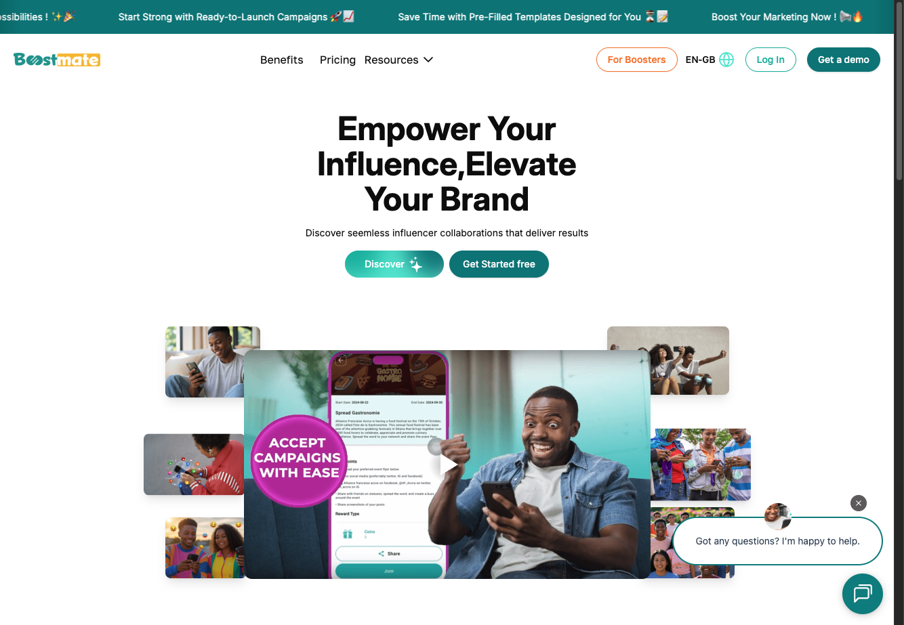
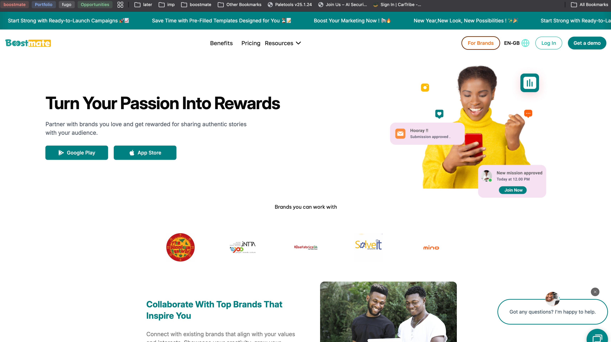
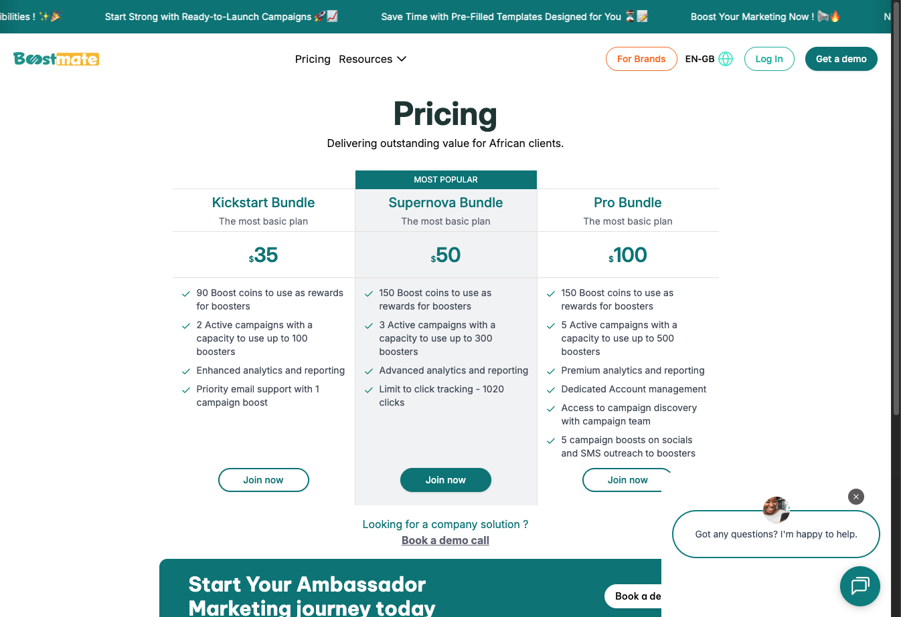
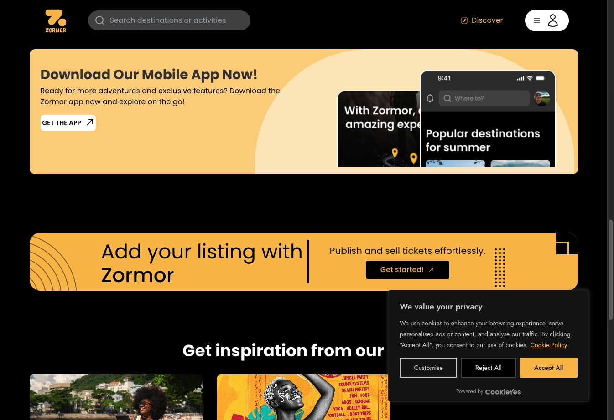
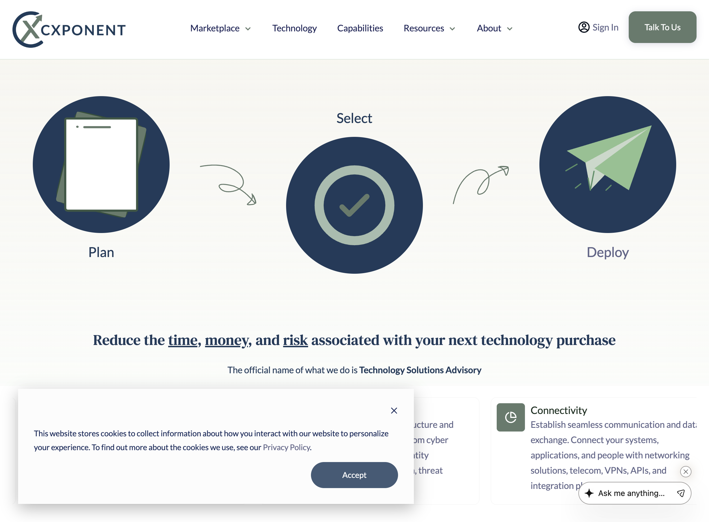
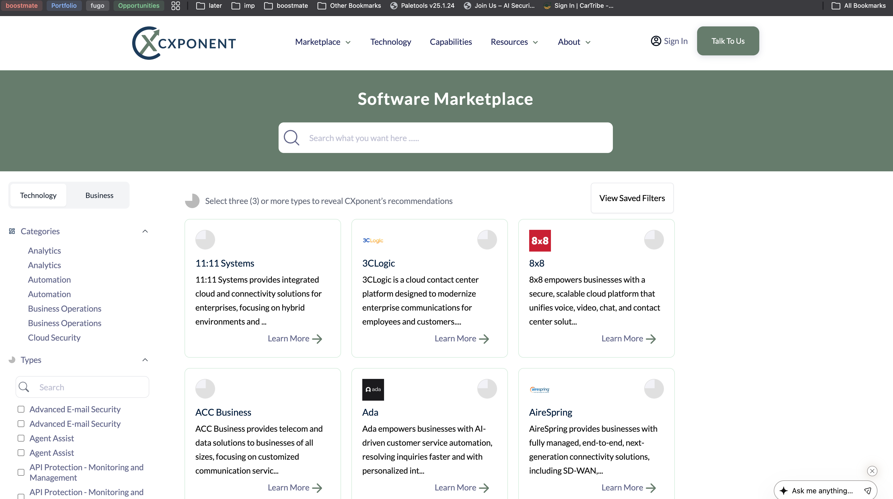
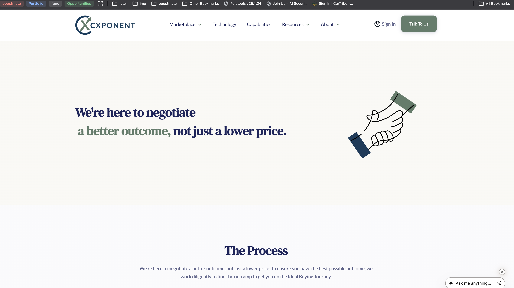

# 🎨 Frontend Solutions

## Boostmate Web

**Built the public-facing website for Boostmate, an ambassador marketing platform. The website showcases the platform's services, pricing plans, and features while providing a seamless user experience for brands and boosters. Features include responsive design, interactive pricing tables, campaign discovery tools, and integrated chat widget. The website effectively communicates Boostmate's value proposition and facilitates lead generation through strategic call-to-action placements.**

### 📸 Preview Screenshots

  
  
  

**🌐 Live Website**: [https://www.theboostmate.com/](https://www.theboostmate.com/)

**[📖 Read Full Project Details](boostmate-web.md)**

---

## Zormor Web

**Built the public-facing website for Zormor, a comprehensive platform for discovering and booking local events, places, and unique experiences. The website enables users to find and book the best local events, places, and experiences in their city, connect with locals, discover hidden gems, and create unforgettable memories. Features include advanced search functionality for activities and locations, destination discovery, event listings, place recommendations, and integrated booking capabilities. The website showcases Zormor's social connectivity features, helping users connect with like-minded people and locals while exploring their city.**

### 📸 Preview Screenshots

  
  
  

**🌐 Live Website**: [https://zormor.com/](https://zormor.com/)

**[📖 Read Full Project Details](zormor-web.md)**

---

## CXponent Web
§
**Built the public-facing website for CXponent, a technology solutions advisory firm. The website showcases the company's three-step process (Plan, Select, Deploy) for helping businesses make technology purchases. Features include a modern dark-themed design, interactive process visualization, technology category marketplace, benefits section, and comprehensive resource library. The website effectively communicates CXponent's value proposition of reducing time, money, and risk in technology purchases while providing clear pathways for businesses to engage with their advisory services.**

### 📸 Preview Screenshots

  
  
  

**🌐 Live Website**: [https://cxponent.com/](https://cxponent.com/)

**[📖 Read Full Project Details](cxponent-web.md)**

---

*[Back to Portfolio](../README.md)*
