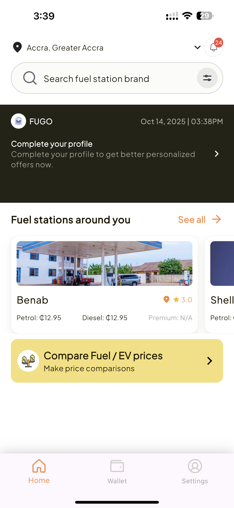
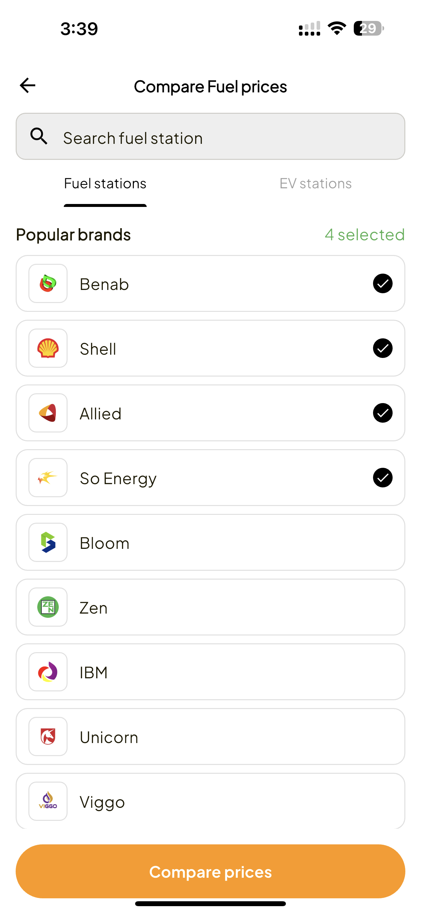
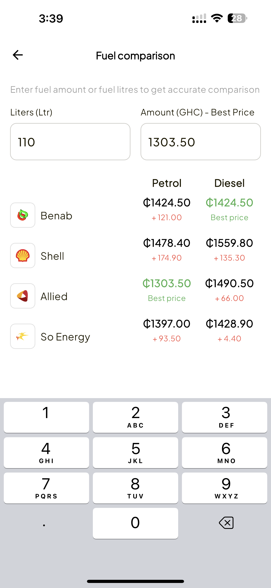
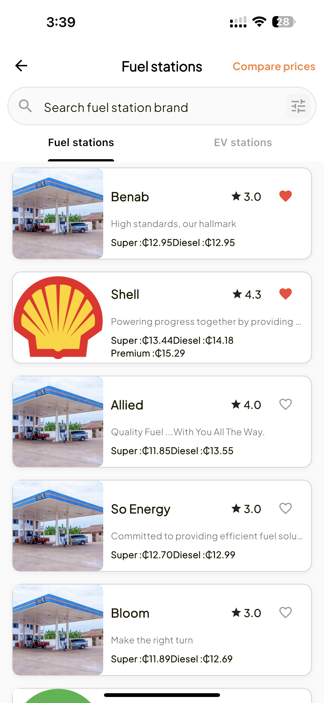
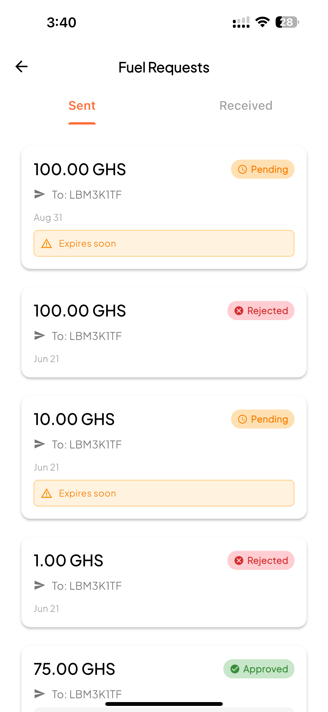

# FUGO - Fuel Management Platform

## 🎯 Overview
FUGO is a comprehensive fuel payments, lending, and management platform that revolutionizes how people handle fuel expenses. The platform combines fintech innovation with social features to create a convenient and affordable solution for fuel management. FUGO aims to simplify fuel management while making it more social and accessible for individuals and groups.

## 🚀 Key Features
- **QR Code-Based Payments**: Seamless fuel payments using QR code technology
- **Fuel Station Locator**: Find nearby fuel stations with real-time availability
- **Personalized Promotions**: Tailored deals and discounts based on usage patterns
- **Credit Score-Based Fuel Lending**: Access fuel credit based on your creditworthiness
- **Social Fuel Sharing**: Share fuel costs with friends and family
- **Expense Tracking**: Monitor and manage fuel expenses with detailed analytics
- **Multi-Payment Options**: Support for various payment methods

### 📸 Preview Screenshots

  
  
  
  
  
  

## 🛠️ Technologies Used
- **Frontend**: Flutter, Dart
- **State Management**: Provider/Riverpod
- **Backend**: Firebase, Node.js
- **Payment Integration**: Stripe, Mobile Money APIs
- **Maps & Location**: Google Maps API
- **Authentication**: Firebase Auth
- **Database**: Firestore
- **Analytics**: Firebase Analytics

## 📖 The Story

### The Challenge
Managing fuel expenses can be cumbersome and expensive. Traditional fuel payment methods lack flexibility, and there's no easy way to track expenses, share costs with others, or access fuel credit when needed. The market needed a modern, user-friendly solution that combines payment convenience with financial flexibility.

### The Solution
FUGO was designed to address these pain points by creating an all-in-one platform for fuel management. The app leverages modern mobile technology to provide:
- Instant QR code payments at fuel stations
- Real-time station locator with availability status
- AI-powered personalized promotions
- Credit-based fuel lending with flexible repayment
- Social features for cost-sharing

### Why These Choices Worked
- **Flutter**: Cross-platform development ensures consistent experience across iOS and Android
- **Firebase**: Scalable backend infrastructure that grows with user base
- **QR Code Technology**: Fast, secure, and contactless payment method
- **Credit Integration**: Provides financial flexibility for users who need it
- **Social Features**: Encourages user engagement and retention

## 🎓 Key Learnings
- **Fintech Integration**: Integrating payment systems requires careful security and compliance considerations
- **Location Services**: Real-time location tracking needs to balance accuracy with battery life
- **Credit Scoring**: Building a fair and transparent credit system is crucial for user trust
- **User Onboarding**: Clear, simple onboarding is essential for financial apps
- **Social Features**: Community features can significantly increase user engagement

## 🔧 Technical Challenges & Solutions

### Challenge 1: Real-Time Location Tracking
*How do you provide accurate fuel station locations and availability in real-time?*

**Solution:** Implemented a combination of:
- Google Maps API for location services
- Real-time database updates for station availability
- Background location services for route optimization
- Caching strategy to reduce API calls and improve performance

### Challenge 2: Payment Security
*How do you ensure secure QR code payments and protect user financial data?*

**Solution:** Implemented multiple layers of security:
- End-to-end encryption for all payment transactions
- Token-based authentication for API calls
- PCI DSS compliance for payment processing
- Biometric authentication for sensitive operations
- Regular security audits and penetration testing

### Challenge 3: Credit Scoring System
*How do you build a fair and accurate credit scoring system?*

**Solution:** Developed a proprietary scoring algorithm that considers:
- Transaction history and payment patterns
- Usage frequency and consistency
- Social connections and referrals
- External credit data integration (with user consent)
- Machine learning for continuous improvement

## 📊 Results & Impact
- **User Growth**: Rapid adoption across target markets
- **Transaction Volume**: Significant increase in digital fuel payments
- **User Satisfaction**: High ratings for ease of use and convenience
- **Credit Utilization**: Positive adoption of fuel lending features
- **Social Engagement**: Active use of cost-sharing features

## 🔗 Links
- **Live Demo**: [Web App]
- **Repository**: [Internal repository]
- **Documentation**: [Internal docs]

## 🎯 Future Improvements
- **AI-Powered Recommendations**: Enhanced personalized promotions using machine learning
- **Expanded Coverage**: Add more fuel stations and service providers
- **Loyalty Program**: Implement rewards and cashback system
- **Business Accounts**: Support for fleet management and corporate accounts
- **Carbon Footprint Tracking**: Help users understand and reduce their environmental impact

---

*[Back to Mobile Solutions](mobile-solutions.md)*

