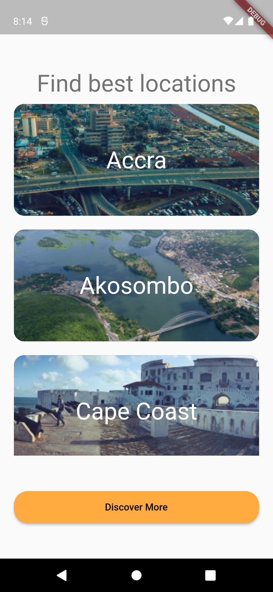
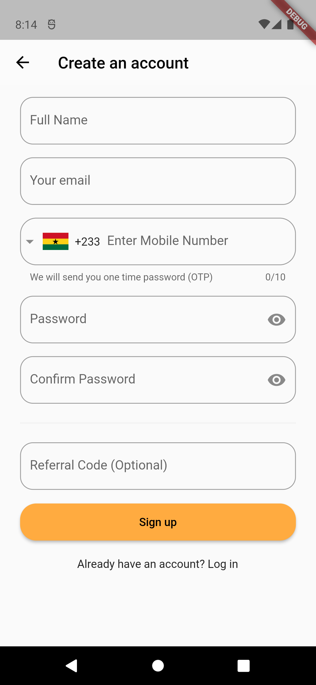
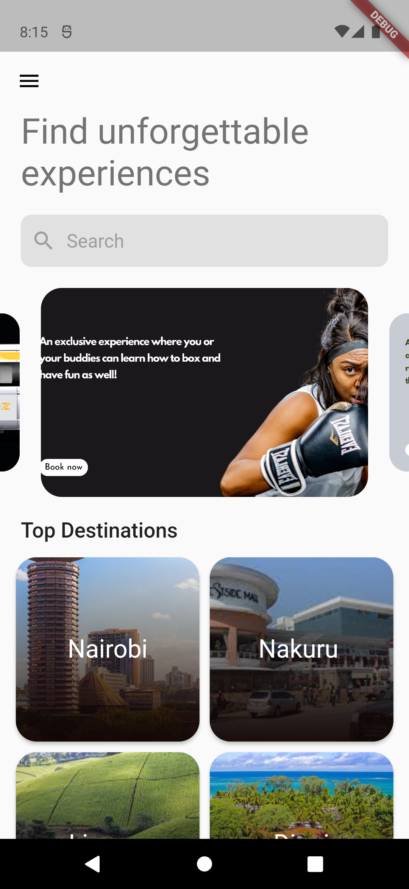

# HENY - Experience Discovery & Booking Platform

## 🎯 Overview
HENY is a comprehensive mobile platform for discovering and booking amazing experiences, restaurants, and places. Built with cutting-edge mobile technologies, HENY connects users with curated activities, virtual experiences, and local businesses, making it easy to find fun things to do anytime, anywhere.

## 🚀 Key Features
- **Experience Discovery**: Find curated activities and experiences in your city
- **Virtual Experiences**: Access amazing activities anywhere, virtually
- **Restaurant & Places**: Explore curated lists of restaurants, cafes, pubs, and bars
- **Curated by Locals**: Locals who love where they come from curate experiences
- **Flexible Cancellation**: Cancel most activities up to 24 hours before at no charge
- **Heny Wallet**: Integrated wallet for seamless payments
- **Multi-Currency Support**: Support for GHS, KES, NGN, ZAR, USD
- **Blog & Inspiration**: Get inspired with curated content and gift ideas

### 📸 Preview Screenshots

  
  
  
  
  
  

## 🛠️ Technologies Used
- **Frontend**: Flutter, Dart
- **State Management**: Bloc Pattern
- **Backend**: Node.js, Express
- **Database**: PostgreSQL, Redis
- **Real-time**: WebSocket, Socket.io
- **Authentication**: JWT, OAuth2
- **Storage**: AWS S3
- **Push Notifications**: Firebase Cloud Messaging

## 📖 The Story

### The Challenge
Finding quality experiences and activities in your city can be overwhelming. With countless options scattered across different platforms, users struggle to discover memorable experiences that are vetted for quality. There's a need for a centralized platform that curates the best experiences and makes them easily discoverable.

### The Solution
HENY was built to solve this problem by creating a comprehensive experience discovery and booking platform. The platform focuses on:
- Curated experiences vetted for quality
- Local curators who know their cities best
- Easy booking with flexible cancellation policies
- Virtual experiences for remote participation
- Integration with restaurants, cafes, and local businesses
- Multi-currency support for global accessibility

### Why These Choices Worked
- **Flutter**: Consistent experience across platforms with native performance
- **Bloc Pattern**: Predictable state management for complex booking flows
- **PostgreSQL**: Reliable data storage for experiences and bookings
- **WebSocket**: Real-time updates for booking availability
- **RESTful API**: Clean, maintainable backend architecture

## 🎓 Key Learnings
- **User Experience**: Simple UI/UX is more valuable than feature complexity
- **Performance**: Mobile apps need to be fast and responsive for booking flows
- **Real-time Availability**: Keeping booking availability synchronized is challenging
- **Notifications**: Smart notification management is crucial for user engagement
- **Curator Quality**: Maintaining high-quality curated experiences requires careful vetting
- **Multi-Currency**: Handling multiple currencies requires careful financial calculations

## 🔧 Technical Challenges & Solutions

### Challenge 1: Real-Time Booking Availability
*How do you handle real-time booking availability without double-bookings?*

**Solution:** Implemented booking lock mechanism:
- Pessimistic locking for high-demand experiences
- WebSocket connections for instant availability updates
- Optimistic UI updates for perceived performance
- Automatic lock release after timeout
- Conflict resolution for concurrent bookings

### Challenge 2: Multi-Currency Support
*How do you handle multiple currencies accurately and efficiently?*

**Solution:** Built comprehensive currency system:
- Real-time exchange rate integration
- Currency conversion at booking time
- User preference for default currency
- Accurate rounding and fee calculations
- Clear display of prices in user's preferred currency

### Challenge 3: Experience Discovery & Search
*How do you help users discover relevant experiences quickly?*

**Solution:** Implemented intelligent search and recommendation:
- Elasticsearch for fast, relevant search results
- Machine learning for personalized recommendations
- Location-based filtering and sorting
- Category-based browsing with filters
- Trending experiences based on user behavior

## 📊 Results & Impact
- **User Growth**: Strong adoption across multiple cities and countries
- **Booking Volume**: Significant increase in experience bookings
- **Curator Network**: Growing community of local curators
- **User Satisfaction**: High ratings for ease of use and experience quality
- **Multi-Currency**: Successfully serving users across Africa and beyond

## 🔗 Links
- **Live Website**: [https://heny.app/](https://heny.app/)
- **Repository**: [Internal repository]
- **Documentation**: [Internal docs]

## 🎯 Future Improvements
- **AI-Powered Recommendations**: Enhanced personalized experience suggestions
- **Advanced Analytics**: Deeper insights into user preferences and trends
- **Social Features**: Share experiences and reviews with friends
- **Loyalty Program**: Rewards and benefits for frequent users
- **Enhanced Virtual Experiences**: More immersive virtual experience offerings

---

*[Back to Mobile Solutions](mobile-solutions.md)*

