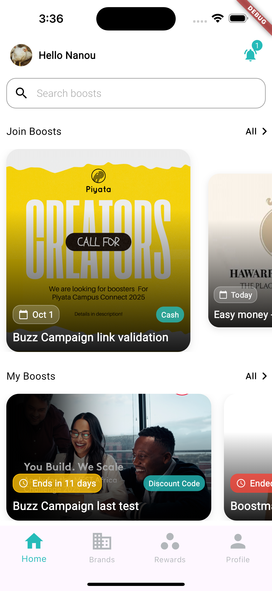
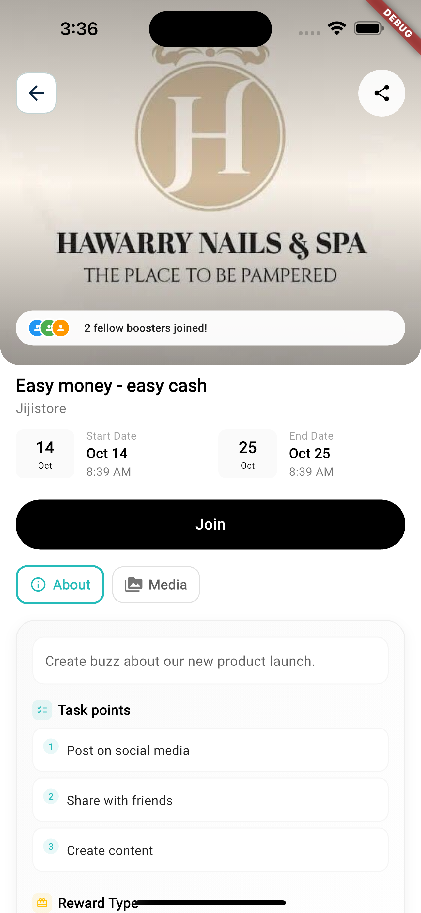
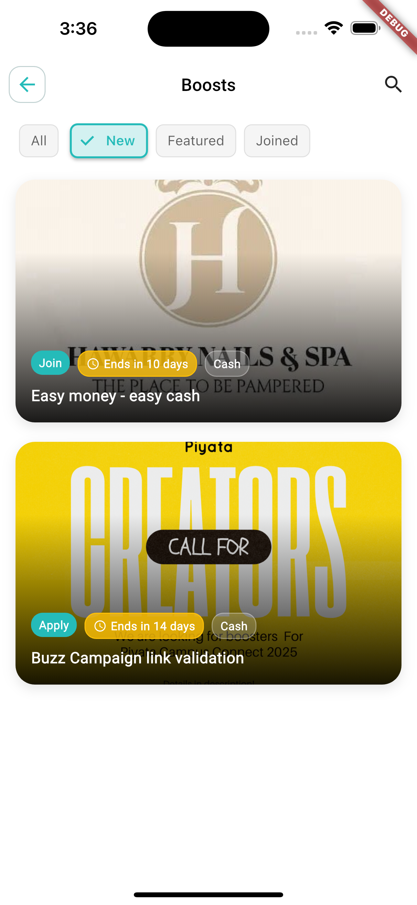
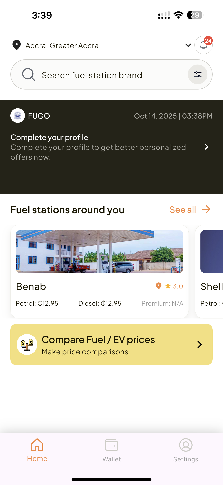
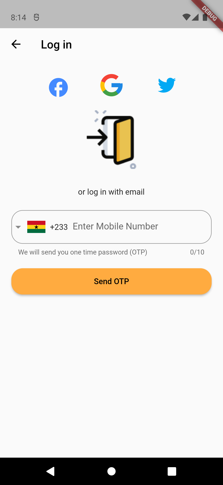
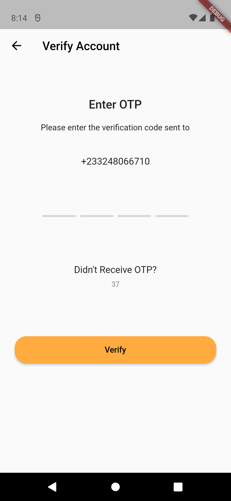
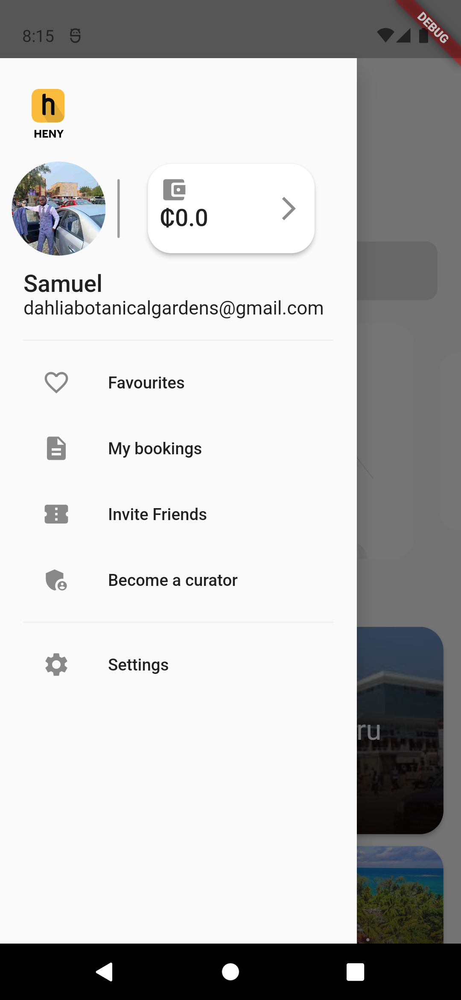

# 📱 Mobile Solutions

## Boostmate App

**Transformed a struggling digital marketing platform from a buggy, unresponsive application into a robust, enterprise-grade solution. Led the complete technical overhaul using Flutter, Domain-Driven Design, and comprehensive testing strategies. The platform now reliably supports lead generation, social media management, and digital marketing campaigns with 80% performance improvement and seamless cross-platform deployment.**

### 📸 Preview Screenshots

  
  
  

**[📖 Read Full Project Details](boostmate-app.md)**

---

## FUGO - Fuel Management Platform

**Building a comprehensive fuel payments, lending, and management platform that revolutionizes how people handle fuel expenses. FUGO combines fintech innovation with social features to create a convenient and affordable solution for fuel management. Key features include QR code-based payments, fuel station locator, personalized promotions, credit score-based fuel lending, and social fuel sharing capabilities.**

### 📸 Preview Screenshots

  
  
  

**[📖 Read Full Project Details](fugo-app.md)**

---

## HENY

**A comprehensive platform for discovering and booking amazing experiences, restaurants, and places. HENY connects users with curated activities, virtual experiences, and local businesses, making it easy to find fun things to do anytime, anywhere.**

### 📸 Preview Screenshots

  
  
  

**[📖 Read Full Project Details](heny-app.md)**

---

## SolarHub

**A comprehensive mobile platform for solar energy management and monitoring. Empowering users to track, analyze, and optimize their solar energy consumption with real-time data and insights.**

### 📸 Preview Screenshots

  
  
  

**[📖 Read Full Project Details](solarhub-app.md)**

---

*[Back to Portfolio](../README.md)*

