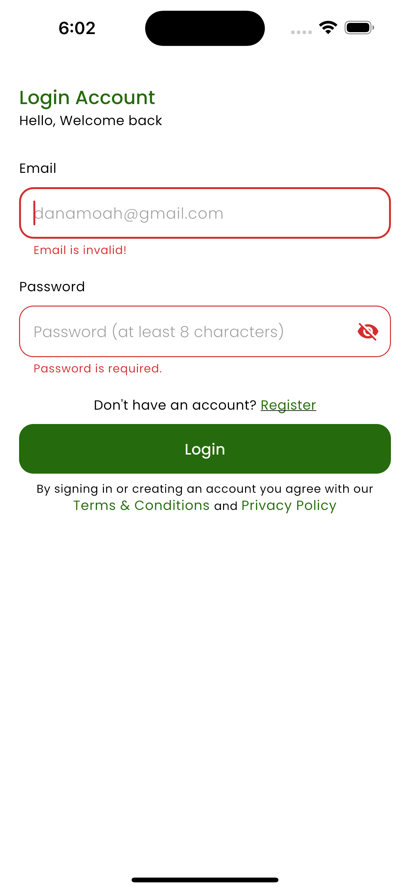
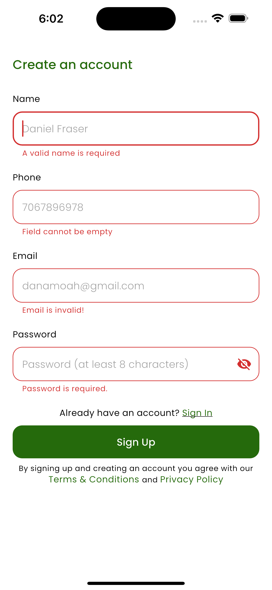

# SolarHub - Solar Energy Education Platform

## 🎯 Overview
SolarHub is a mobile learning platform focused on solar energy education and advocacy. It's designed to educate users about solar energy through courses, interactive trivia, real-world case studies, and practical tools. The platform combines education with practical tools to help users understand and implement solar energy solutions.

## 🚀 Key Features

### 📚 Courses & Learning
- **Course Catalog**: Browse and enroll in solar energy courses
- **Course Types**: Live courses with scheduled dates and on-demand courses
- **Video Lessons**: YouTube integration for course content
- **Course Structure**: Organized sections and modules
- **Reviews & Ratings**: User feedback on courses
- **Certificates**: Earn certificates upon course completion
- **Progress Tracking**: Monitor course duration and completion
- **Payment Integration**: Course enrollment with payment support

### 🎮 Solar Trivia Games
- **Interactive Quizzes**: Multiple question types (text and image-based)
- **Timer-Based Questions**: Challenge yourself with time limits
- **Score Tracking**: Track your performance
- **Progress Monitoring**: See your improvement over time
- **Performance Review**: Detailed results and feedback
- **Gamification**: Engaging elements to keep learning fun

### 🔧 Energy Audit Tool
- **Step-by-Step Wizard**: Guided energy audit process
- **Appliance Selection**: Choose and analyze appliances
- **Consumption Calculations**: Calculate energy usage
- **Energy Reports**: Detailed reports and recommendations
- **Usage Insights**: Understand your energy consumption patterns

### 💼 Solar Makeovers
- **Real-World Case Studies**: Actual solar installation projects
- **Before/After Transformations**: Visual project showcases
- **Video Content**: Video demonstrations of solar projects
- **Company Profiles**: Learn about solar companies
- **Implementation Education**: Understand solar implementations

### 💬 Instructor Chat
- **Direct Messaging**: Chat directly with course instructors
- **Real-Time Communication**: Instant messaging functionality
- **Message History**: Access past conversations
- **Date-Grouped Conversations**: Organized chat history

### 💰 Wallet System
- **In-App Wallet**: Manage course payments
- **Flutterwave Integration**: Secure payment gateway
- **Transaction History**: Track all payments
- **Balance Management**: Monitor wallet balance
- **Multiple Payment Methods**: Card, bank transfer, USSD, and more

### 👤 User Profile & Settings
- **Firebase Authentication**: Secure user accounts
- **Google Sign-In**: Quick authentication option
- **Profile Management**: Customize your profile
- **Display Name & Photo**: Personalize your account
- **Enrollment Tracking**: Monitor your course enrollments
- **Progress Tracking**: Track your learning journey

### 🔐 Authentication
- **Email/Password**: Traditional authentication
- **Google Sign-In**: Social authentication
- **Onboarding Flow**: New user introduction
- **Session Management**: Secure session handling

### 📸 Preview Screenshots

  
  
  
  
  
  

## 🛠️ Technologies Used
- **Framework**: Flutter, Dart
- **Backend**: Firebase (Firestore, Auth, Storage)
- **State Management**: Riverpod
- **Payment**: Flutterwave
- **Video**: YouTube Player, Video Player
- **Local Storage**: Hive
- **Architecture**: Clean architecture with providers and repositories
- **Authentication**: Firebase Auth, Google Sign-In

## 📖 The Story

### The Challenge
There's a growing need for solar energy education and advocacy, but existing platforms lack comprehensive learning tools and practical resources. Users need accessible, engaging ways to learn about solar energy, from basic concepts to real-world implementations. The market needed a platform that combines education with practical tools.

### The Solution
SolarHub was designed to be a comprehensive learning platform for solar energy education. The platform offers:
- Interactive courses with video lessons and certificates
- Gamified learning through trivia and quizzes
- Practical tools like energy audit calculators
- Real-world case studies and solar makeovers
- Direct instructor communication
- Integrated payment and wallet system

### Why These Choices Worked
- **Flutter**: Consistent cross-platform experience with native performance
- **Firebase**: Scalable backend with real-time capabilities
- **Riverpod**: Type-safe state management for complex app state
- **Flutterwave**: Reliable payment processing with multiple options
- **Clean Architecture**: Maintainable and testable codebase

## 🎓 Key Learnings
- **Educational Content**: Creating engaging educational content requires careful planning
- **Video Integration**: YouTube player integration needs careful error handling
- **Payment Processing**: Flutterwave integration requires proper error handling and user feedback
- **Real-time Chat**: Firebase real-time database is excellent for chat functionality
- **Clean Architecture**: Proper separation of concerns makes the app maintainable and testable
- **User Experience**: Gamification and interactive elements increase engagement

## 🔧 Technical Challenges & Solutions

### Challenge 1: Video Playback
*How do you integrate YouTube videos and ensure smooth playback?*

**Solution:** Implemented robust video player system:
- YouTube Player plugin for YouTube content
- Video Player for local video files
- Proper error handling and loading states
- Offline video caching with Hive
- Playback state management with Riverpod

### Challenge 2: Payment Integration
*How do you securely process payments for course enrollments?*

**Solution:** Integrated Flutterwave payment gateway:
- Flutterwave SDK for payment processing
- Multiple payment methods (card, bank, USSD, etc.)
- Secure transaction handling
- Wallet system for in-app payments
- Transaction history and receipts

### Challenge 3: Real-Time Chat
*How do you enable real-time messaging with instructors?*

**Solution:** Implemented Firebase-based chat system:
- Firestore for message storage
- Real-time listeners for instant updates
- Date-grouped message organization
- Message state management (sent, delivered, read)
- Efficient pagination for chat history

## 📊 Results & Impact
- **User Engagement**: High course completion rates and active learning
- **Educational Impact**: Users gain practical solar energy knowledge
- **Platform Growth**: Growing user base and course catalog
- **User Satisfaction**: Positive feedback on course quality and platform usability
- **Knowledge Transfer**: Successfully educating users about solar energy

## 🔗 Links
- **Live Demo**: [Web App]
- **Repository**: [Internal repository]
- **Documentation**: [Internal docs]

## 🎯 Future Improvements
- **AI-Powered Recommendations**: Personalized course recommendations
- **Community Features**: User forums and discussion boards
- **Advanced Analytics**: Detailed learning analytics and progress tracking
- **Offline Mode**: Download courses for offline viewing
- **Multi-Language Support**: Expand to more languages and regions

---

*[Back to Mobile Solutions](mobile-solutions.md)*

